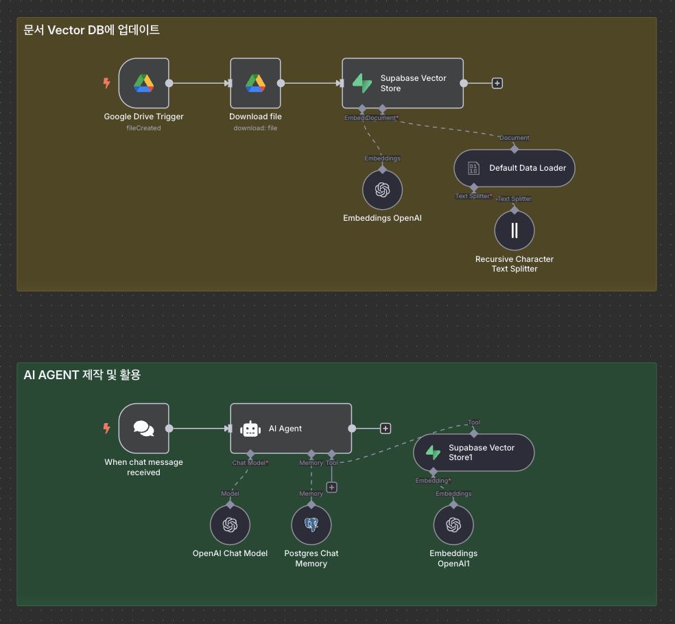

# n8n RAG Agent 구축 가이드



n8n과 Supabase를 활용하여 문서 기반 질답이 가능한 RAG(Retrieval Augmented Generation) Agent를 구축하는 종합 가이드입니다.

## 목차

- [RAG 개념 이해](#rag-개념-이해)
- [사전 준비사항](#사전-준비사항)
- [Supabase 벡터 스토어 설정](#supabase-벡터-스토어-설정)
- [문서 업로드 워크플로우 구축](#문서-업로드-워크플로우-구축)
- [RAG Agent 설정](#rag-agent-설정)
- [테스트 및 활용](#테스트-및-활용)
- [한계점 및 개선 방향](#한계점-및-개선-방향)
- [FAQ](#faq)

## RAG 개념 이해

### RAG란?

**RAG(Retrieval Augmented Generation)**는 다음 3단계로 구성됩니다:

1. **Retrieval (검색)**: 사용자 질문과 관련된 문서 조각을 검색
2. **Augmented (보강)**: 검색된 정보로 답변 품질 향상
3. **Generation (생성)**: 맥락에 맞는 답변 생성

### RAG 작동 원리

#### 1단계: 문서 전처리 및 저장
1. 문서를 작은 **청크(chunk)**로 분할
2. 각 청크를 **임베딩(embedding)**을 통해 벡터(숫자)로 변환
3. 벡터 데이터베이스에 저장

#### 2단계: 질문 처리 및 검색
1. 사용자 질문을 동일한 방식으로 벡터로 변환
2. 벡터 유사도를 계산하여 관련 청크 검색
3. 가장 유사한 청크들을 선별

#### 3단계: 답변 생성
1. 검색된 청크와 원본 질문을 LLM에 입력
2. 맥락을 고려한 정확한 답변 생성

## 사전 준비사항

### 필수 계정 및 API 키
- **Supabase 계정**: 벡터 데이터베이스용
- **OpenAI API 키**: 임베딩 및 답변 생성용
- **Google 계정**: Google Drive 연동용
- **n8n 설치**: 로컬 또는 클라우드

### 참고 문서 준비
- 질의응답에 활용할 문서들 (PDF, Google Docs, 텍스트 파일 등)
- Google Drive 폴더 생성

## Supabase 벡터 스토어 설정

### 1. Supabase 프로젝트 생성

1. [supabase.com](https://supabase.com)에 접속하여 회원가입
2. 새 프로젝트 생성
3. 데이터베이스 비밀번호 설정 (잘 기억해두세요)
4. Region 한국/서울로 설정

### 2. 벡터 데이터베이스 초기화

1. Supabase 프로젝트에서 **SQL Editor** 이동
2. 다음 SQL 코드를 실행하여 벡터 스토어 테이블 생성:

```sql
-- Enable the pgvector extension to work with embedding vectors
create extension vector;

-- Create a table to store your documents
create table documents (
  id bigserial primary key,
  content text, -- corresponds to Document.pageContent
  metadata jsonb, -- corresponds to Document.metadata
  embedding vector(1536) -- 1536 works for OpenAI embeddings, change if needed
);

-- Create a function to search for documents
create function match_documents (
  query_embedding vector(1536),
  match_count int DEFAULT null,
  filter jsonb DEFAULT '{}'
) returns table (
  id bigint,
  content text,
  metadata jsonb,
  embedding jsonb,
  similarity float
)
language plpgsql
as $$
#variable_conflict use_column
begin
  return query
  select
    id,
    content,
    metadata,
    (embedding::text)::jsonb as embedding,
    1 - (documents.embedding <=> query_embedding) as similarity
  from documents
  where metadata @> filter
  order by documents.embedding <=> query_embedding
  limit match_count;
end;
$$;
```

### 3. API 키 확인

**Project Settings > Data API**에서 다음 정보 확인:
- **Project URL**: Host URL로 사용

**Project Settings > API Keys**에서 다음 정보 확인:
- **Service Role Secret**: API 키로 사용

## 문서 업로드 워크플로우 구축

### 1. Google Drive 트리거 설정

1. **새 워크플로우 생성**
2. **Google Drive > On Changes Involving a Specific Folder** 트리거 추가
3. Google 계정 인증 및 폴더 선택
4. 주기 설정 (예: 1분마다 확인)

### 2. 파일 다운로드 노드 추가

1. **Google Drive > Download File** 노드 추가
2. File ID: `{{ $json.id }}` 매핑

### 3. Supabase Vector Store 설정

1. **Supabase Vector Store** 노드 추가
2. **Operation**: Add Documents to Vector Store 선택
3. **Supabase 인증 설정**:
   - Host: Supabase Project URL
   - Service Role Secret: Supabase API Key
4. **Table Name**: `documents` 선택

### 4. Document Loader 설정

**Default Data Loader** 옵션에서:
- **Metadata 추가**:
  - Name: `document_title`
  - Value: `{{ $('Google Drive Trigger').item.json.name }}`

### 5. Text Splitter 설정

**Custom** 선택 후 **Recursive Character Text Splitter**:
- **Chunk Size**: 1000
- **Chunk Overlap**: 0

### 6. Embedding 설정

**OpenAI Embeddings**:
- Model: `text-embedding-3-small`
- OpenAI API 키 인증 필요

## RAG Agent 설정

### 1. Chat Trigger 설정

1. **새 워크플로우 생성**
2. **Chat Message Received** 트리거 추가

### 2. AI Agent 노드 추가

1. **AI > AI Agent** 노드 추가
2. **Chat Model**: OpenAI GPT-4.1 선택

### 3. 시스템 프롬프트 설정

```
You are a helpful and knowledgeable assistant that answers questions based only on the given Korean documents (context).

Guidelines:
- Your answers must be based **only** on the provided context.
- If the context does **not** contain the information needed, say "해당 문서에는 정보가 없습니다." and do not make up an answer.
- Provide **clear answers in Korean**.
- If the user asks in English, still respond in Korean using the context.

Context documents are in Korean.
```

### 4. Supabase Vector Store Tool 추가

1. **Tools** 섹션에서 **Supabase Vector Store** 추가
2. **Operation**: Retrieve Documents 선택
3. **Description**:
```
Retrieve internal company documents related to policies, rules, or procedures based on semantic similarity to the question.
```
4. **Top K**: 4 (검색할 문서 청크 개수)
5. **Embeddings**: OpenAI Embeddings (text-embedding-3-small)

### 5. 메모리 설정 (선택사항)

#### 간단한 메모리
**Simple Memory**:
- Context Window Length: 5

#### PostgreSQL 메모리 (Supabase 연동)
**PostgreSQL Chat Memory**:
- **Host**: Supabase Host (transaction pooler 사용)
- **Database**: postgres
- **Port**: 6543
- **Username**: Supabase Username
- **Password**: 프로젝트 비밀번호

## 테스트 및 활용

### 테스트 시나리오

#### 1. 사내 규정 문서 테스트
```
구씨컴퍼니 겸업관련 조항이 어떻게 돼?
```

```
입사한 지 6개월이 안 되었는데, 연차 사용이 가능한가요?
```

```
출퇴근 시간은 어떻게 되나요?
```

#### 2. 고객 응대 매뉴얼 테스트
```
고객이 배송 지연으로 환불을 요구할 때 어떻게 응대하라고 되어 있어?
```

```
고객이 상품에 불만을 표현할 때 첫 응대는 어떻게 하나요?
```

### 활용 방법

1. **Public URL 생성**: 여러 사용자가 접근 가능한 챗봇
2. **Slack 연동**: 팀 커뮤니케이션 도구와 통합
3. **이메일 트리거**: 이메일로 질문 받아 답변

## 한계점 및 개선 방향

### 현재 RAG의 한계점

1. **키워드 기반 검색 한계**
   - 특정 모델명, 색상, 사이즈 등 정확한 키워드 검색에 취약
   - 의미 유사도 기반이라 정확한 매칭이 어려운 경우 존재

2. **전체 문서 요약 한계**
   - 문서를 청크로 나누어 저장하므로 전체적인 요약 어려움
   - 문서 전반의 흐름이나 구조 파악 제한

3. **계산 작업 한계**
   - 숫자 계산이나 데이터 분석 작업에 부적합
   - 단순 정보 검색 및 답변에 특화

### 개선 방향

1. **하이브리드 검색**: 의미 검색 + 키워드 검색 조합
2. **청크 크기 최적화**: 문서 특성에 맞는 청크 크기 조정
3. **메타데이터 활용**: 문서 분류 및 필터링 강화
4. **다단계 검색**: 초기 검색 후 재검색으로 정확도 향상

## FAQ

### Q: 어떤 파일 형식을 지원하나요?
A: Google Docs, PDF, 텍스트 파일 등 대부분의 문서 형식을 지원합니다. n8n의 Document Loader가 자동으로 텍스트를 추출합니다.

### Q: 문서 업데이트는 어떻게 하나요?
A: Google Drive 폴더에 새 파일을 추가하면 자동으로 벡터 데이터베이스에 추가됩니다. 기존 파일 수정 시에는 재업로드가 필요합니다. 기존 문서를 삭제하고 업데이트하려면, 먼저 삭제를 해주는 워크플로우 생성이 필요합니다. 

### Q: 답변 정확도를 높이려면?
A: 다음 방법들을 시도해보세요:
- 청크 크기 조정 (500-2000자 범위)
- 청크 Limit 값 조정 (2-8 범위)
- 더 구체적인 시스템 프롬프트 작성
- 관련 없는 문서 제거

### Q: 비용은 얼마나 발생하나요?
A: 주요 비용 요소:
- OpenAI API: 임베딩 ($0.02/1M tokens) + GPT-4.1(Input $2, output $8/ 1M tokens) 사용료
- Supabase: 무료 티어에서 시작 가능
---

이 가이드를 통해 n8n과 Supabase를 활용한 RAG Agent를 구축하여 문서 기반 업무 효율성을 크게 향상시킬 수 있습니다. 회사 내부 문서, 매뉴얼, 가이드라인 등을 AI가 대신 참조하여 답변해주는 시스템을 구축해보세요.
