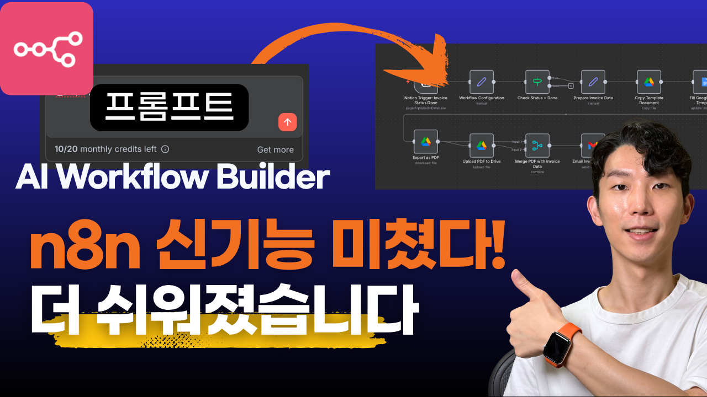
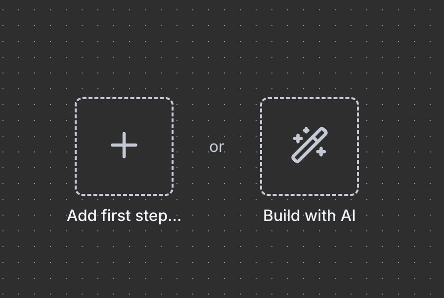
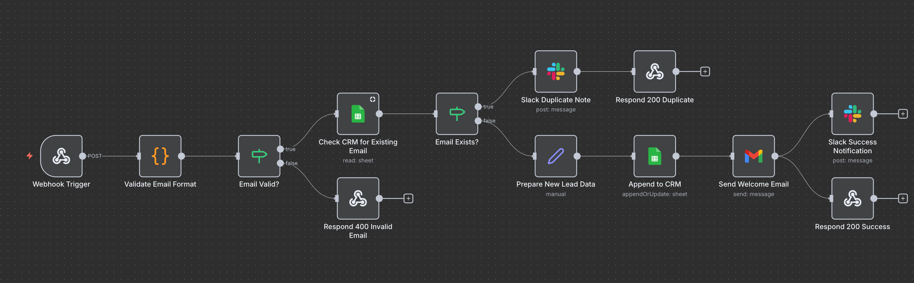
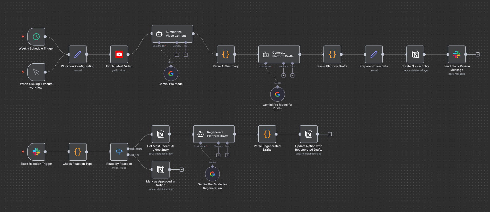

# n8n AI Workflow Builder 완벽 가이드




n8n의 새로운 AI Workflow Builder를 활용하여 자연어 프롬프트만으로 워크플로우를 자동 생성하는 방법을 단계별로 안내합니다.

## 📋 목차

- [소개](#소개)
- [시작하기](#시작하기)
- [데모 1: 리드 마그넷 자동화 (입문)](#데모-1-리드-마그넷-자동화-입문)
- [데모 2: 인보이스 자동 발행 시스템 (중급)](#데모-2-인보이스-자동-발행-시스템-중급)
- [데모 3: 콘텐츠 재가공 파이프라인 (상급)](#데모-3-콘텐츠-재가공-파이프라인-상급)
- [크레딧 시스템](#크레딧-시스템)
- [한계점 및 활용 전략](#한계점-및-활용-전략)

---

## 소개

**n8n AI Workflow Builder**는 자연어 프롬프트만으로 복잡한 워크플로우를 자동 생성해주는 기능입니다. 워크플로우 제작의 진입장벽을 크게 낮춰줍니다.

### 주요 특징

- 🤖 **자연어 프롬프트**로 워크플로우 생성
- 🔄 **점진적 개선** 가능 (추가 요청으로 기능 확장)
- 🐛 **AI 디버깅 지원** (에러 로그 기반 수정 제안)
- 📚 **학습 도구**로 활용 가능 (생성된 워크플로우를 보며 학습)

---

## 시작하기

### 사전 요구사항

1. **n8n Cloud 계정** (현재 셀프호스팅 미지원)
2. **무료 트라이얼** (2주) 또는 유료 플랜
3. **버전 1.117.1 이상** (Latest Stable)

### 설치 및 설정

1. n8n Cloud에 로그인
2. 설정 > Admin Panel > 버전 관리
3. 최신 버전(1.117.1 이상)으로 업데이트
4. 며칠 후 **Build with AI** 버튼 활성화 확인

> **참고**: 셀프호스팅 사용자를 위한 방법은 현재 검토 중이며, 추후 지원 예정입니다.

### 기본 사용법



1. **Create a workflow** 클릭
2. **Build with AI** 버튼 선택
3. 프롬프트 입력창에 원하는 워크플로우 설명 작성
4. **Generate** 버튼 클릭
5. 생성된 워크플로우 검토 및 수정

---

## 데모 1: 리드 마그넷 자동화 (입문)

### 시나리오 개요

랜딩 페이지에서 사용자가 이메일을 입력하고 "무료 가이드 받기" 버튼을 누르면 자동으로:
- 이메일 유효성 검사
- Google Sheets CRM 중복 체크
- 신규 리드 정보 저장
- Gmail로 eBook 다운로드 링크 발송
- Slack에 신규 리드 알림

### 프롬프트

```text
Create an n8n workflow that:
1) Receives a POST webhook with JSON {name, email, utm_source, utm_campaign}.
2) Validate the email format; if invalid, respond 400 with {"error":"invalid_email"} and stop.
3) Check Google Sheets "CRM" for existing email; if found, respond 200 {"status":"duplicate"} and post a short Slack note.
4) If new, append {timestamp, name, email, utm_source, utm_campaign}.
5) Send a Gmail message to the user with a download link (placeholder URL) and a short welcome message.
6) On any failure, send a Slack alert with the error snippet and payload.
Keep mappings simple and note where credentials are required.
```

### 워크플로우 구조



```
1. Webhook Trigger (POST)
   ↓
2. Validate Email Format (Code 노드)
   ↓
3. Email Valid? (IF 노드)
   ├─ [유효하지 않음] → Respond 400 Invalid Email
   └─ [유효함] → Check CRM for Existing Email (Google Sheets)
                  ↓
4. Email Exists? (IF 노드)
   ├─ [존재함] → Slack Duplicate Note → Respond 200 Duplicate
   └─ [신규] → Prepare New Lead Data (Set 노드)
              ↓
5. Append to CRM (Google Sheets)
   ↓
6. Send Welcome Email (Gmail)
   ↓
7. [병렬] Respond 200 Success + Slack Success Notification
```

### 수동 설정 필요 사항

1. **Google Sheets 연결**
   - CRM 시트 ID 입력
   - 컬럼명 확인 및 매핑 수정

2. **Credential 설정**
   - Google Sheets OAuth 인증
   - Gmail OAuth 인증
   - Slack OAuth 인증

3. **세부 설정**
   - "Always Output Data" 옵션 활성화 (Google Sheets 노드)
   - Webhook Trigger를 "Using 'Respond to Webhook' Node"로 설정

### 테스트 예시

```bash
curl -X POST "https://your-n8n-instance.app.n8n.cloud/webhook-test/lead-capture" \
  -H "Content-Type: application/json" \
  -d '{
    "name": "홍길동",
    "email": "test@example.com",
    "utm_source": "youtube",
    "utm_campaign": "lead_magnet_101"
  }'
```

### 추가 수정 예시

기존 워크플로우에 기능 추가:

```text
Update the workflow to:
- If utm_source is missing, set it to "direct".
- Add a Slack message thread reply with the user's email on success.
Do not remove nodes; only add what is necessary.
```

### 평가

**✅ 장점**
- 생성 속도: 30초 만에 기본 골격 완성
- 구조 정확도: 요청한 로직 흐름 정확히 구현
- 점진적 개선: 추가 요청으로 기능 확장 가능

**⚠️ 한계**
- 매핑 정확도: 컬럼명/필드명 수동 보정 필요
- Credential 설정: 계정 연결 직접 수행
- 세부 로직: retry, error 설정 등 수동 조정 필요

**실무 적합도: ★★★★☆ (4/5)**

---

## 데모 2: 인보이스 자동 발행 시스템 (중급)

### 시나리오 개요

Notion에서 프로젝트 상태를 "Done"으로 변경하면 자동으로:
- Google Docs 템플릿으로 인보이스 생성
- 고객명/품목/금액/계좌 정보 자동 매핑
- PDF로 변환 및 내보내기
- Google Drive 업로드
- Gmail로 고객에게 송부
- Slack 채널에 알림

### 프롬프트

```text
Build a workflow that:
1) Trigger on Notion DB "invoice-test" item updated where status == "Done".
2) From Google Drive, COPY the Docs template (templateFileId placeholder) into a working/destination folder (folderId placeholder). Rename to "invoice-{{client_name}}-{{due_date}}". Return the NEW fileId.
3) Use the COPIED Google Doc (new fileId) to fill fields:
   {client_name, project_title, items, subtotal, tax, total, due_date, bank_info}.
4) Export that copied Doc as PDF and upload/save to a target Drive folder (placeholder folderId). Capture PDF link.
5) Email the PDF to the client via Gmail with a polite message and payment instructions.
6) Post a Slack message to #finance with {client_name, total, due_date, document_link}.
7) Add basic retry for Drive/Gmail and log errors to Slack. If filling fails, include the Doc link for manual review.
Keep mappings readable and clearly mark placeholders for credentials, templateFileId, and folderId.
```

### 워크플로우 구조


1. Notion Trigger: Invoice Status Done
   ↓
2. Workflow Configuration (Set 노드 - 템플릿 ID, 폴더 ID 등)
   ↓
3. Check Status = Done (IF 노드)
   ↓
4. Prepare Invoice Data (Set 노드)
   ↓
5. Copy Template Document (Google Drive)
   ↓
6. Fill Google Docs Template (Google Docs - Replace All)
   ↓
7. Export as PDF (Google Drive)
   ↓
8. [병렬 처리]
   ├─ Upload PDF to Drive
   └─ Merge PDF with Invoice Data
      ↓
9. Email Invoice to Client (Gmail - 첨부파일 포함)
   ↓
10. Notify Finance on Slack
```

### 수동 설정 필요 사항

1. **Google Docs 템플릿 준비**
   - 자리표시자 형식: `{{client_name}}`, `{{total}}` 등
   - 템플릿 ID 확인 및 입력

2. **Notion 데이터베이스 설정**
   - 필드 타입 확인 (Text, Number, Date 등)
   - 필드명 매핑 수정

3. **API 활성화**
   - Google Cloud Console에서 Google Docs API 활성화

4. **데이터 매핑 수정**
   - Edit Fields 노드에서 Notion 데이터 참조 수정
   - 예: `{{$json.properties.ClientEmail}}` → `{{$json.ClientEmail}}`

### 에러 발생 및 해결 예시

**에러 1: Google Docs API 미활성화**
- 증상: "API not enabled" 에러
- 해결: Google Cloud Console에서 Google Docs API 활성화

**에러 2: 데이터 매핑 오류**
- 증상: Notion 데이터를 제대로 가져오지 못함
- 해결: Edit Fields 노드에서 참조 경로 수정

**에러 3: Gmail 첨부파일 오류**
- 증상: PDF 첨부파일 전송 실패
- 해결: Merge 노드 추가하여 PDF 데이터와 인보이스 데이터 병합

### AI 디버깅 예시

Gmail node 첨부파일 인식 수정:

```text
Google Drive file is not attached to the gmail node right now. Please change the flow so that it attaches the "Data" file from google drive.
keep other nodes same, and only change the export pdf part.
```

### 평가

**✅ 장점**
- 실무 루틴 자동화: "견적 → 청구" 프로세스 뼈대 즉시 완성
- 에러 처리: Retry 로직과 에러 브랜치 자동 생성
- 디버깅 지원: AI가 에러 로그 기반 수정 제안

**⚠️ 한계**
- 템플릿 매핑: Google Docs 자리표시자 수동 설정 필요
- Notion 속성: 필드 타입 불일치 시 에러 발생 가능
- Drive 파일 참조: 지메일에서 파일 참조 가능하게 Flow 구현

**실무 적합도: ★★★★☆ (4/5)**

---

## 데모 3: 콘텐츠 재가공 파이프라인 (상급)

### 시나리오 개요

매주 금요일, 유튜브 콘텐츠를 각 SNS 플랫폼에 맞는 포맷으로 재가공:
- YouTube 채널 최신 영상 1개 수집
- Gemini Pro로 영상 내용 요약 + 훅 + CTA 생성
- 플랫폼별 초안 생성 (X, LinkedIn, Newsletter)
- Notion "AI Video" DB에 기록
- Slack에 체크 요청
- Slack 이모지 반응으로 초안 재생성 또는 승인

### 프롬프트

```text
Build an advanced weekly content repurposing workflow for a solo creator/marketing team. 
Keep node/field names in English. All user-facing text (Slack messages, drafts, email/doc text) MUST be in Korean.

Requirements:
1) Trigger: scheduled every Friday (manual trigger also allowed).
2) Source: fetch the latest 1 video from YouTube channel @citizendev9c. Get title, URL, publish date, description.
3) Summarization model: use Gemini Pro to produce:
   - 3-bullet summary of the video
   - 1 strong hook idea
   - 1 clear CTA
4) Generate platform-ready drafts:
   - X: <=280 chars + 3 hashtags
   - LinkedIn: 3 paragraphs (hook, insight, CTA)
   - Newsletter: 5 short paragraphs with source link(s)
5) Save to Notion database named "AI Video" with fields:
   {video_title, video_url, published_at, summary_bullets, hook, cta, draft_x, draft_linkedin, draft_newsletter, created_at}
6) Post a Slack message asking for review/approval with links to the Notion item and video.
7) If a Slack emoji reaction is added to that message (e.g., :repeat:), regenerate the platform drafts (re-run step 4) and update Notion. 
   If an approval emoji (e.g., :white_check_mark:) is added, mark the Notion item as "Approved".
8) Clearly mark placeholders for API keys/credentials (YouTube/Slack/Notion/Gemini). 
9) Keep mappings explicit and comment where manual edits are needed.
```

### 워크플로우 구조



**메인 플로우 (매주 금요일 자동 실행)**

```
1. Weekly Schedule Trigger (매주 금요일 오전 9시)
   ↓
2. Workflow Configuration (Set 노드 - 채널 ID, DB 이름 등)
   ↓
3. Fetch Latest Video (YouTube API)
   ↓
4. Summarize Video Content (AI Agent + Gemini Pro)
   ↓
5. Parse AI Summary (Code 노드)
   ↓
6. Generate Platform Drafts (AI Agent + Gemini Pro)
   ↓
7. Parse Platform Drafts (Code 노드)
   ↓
8. Prepare Notion Data (Set 노드)
   ↓
9. Create Notion Entry (Notion API)
   ↓
10. Send Slack Review Message (Slack)
```

**승인/재생성 플로우 (Slack 이모지 반응 시)**

```
1. Slack Reaction Trigger
   ↓
2. Check Reaction Type (Code 노드)
   ↓
3. Route By Reaction (Switch 노드)
   ├─ [repeat 이모지] → Get Most Recent AI Video Entry (Notion)
   │                     ↓
   │                    Regenerate Platform Drafts (AI Agent)
   │                     ↓
   │                    Parse Regenerated Drafts (Code 노드)
   │                     ↓
   │                    Update Notion with Regenerated Drafts
   │
   └─ [white_check_mark 이모지] → Mark as Approved in Notion
```

### 수동 설정 필요 사항

1. **API 연결**
   - YouTube Data API v3
   - Google Gemini (PaLM) API
   - Notion API
   - Slack API

2. **Notion 데이터베이스 설정**
   - 데이터베이스 이름: "AI Video"
   - 필드 생성:
     - video_title (Title)
     - video_url (URL)
     - published_at (Date)
     - summary_bullets (Rich Text)
     - hook (Rich Text)
     - cta (Rich Text)
     - draft_x (Rich Text)
     - draft_linkedin (Rich Text)
     - draft_newsletter (Rich Text)
     - created_at (Date)
     - status (Status)

3. **Slack 워크스페이스 설정**
   - 채널 ID 확인
   - 봇 권한 설정 (메시지 전송, 반응 감지)

### 플랫폼별 초안 예시

**X (트위터)**
```
AI 자동화로 시간 절약하는 3가지 방법 🤖 
1) 반복 작업 워크플로우화 
2) 데이터 파이프라인 구축 
3) 크로스 플랫폼 배포 
#AI #Automation #Productivity
```

**LinkedIn**
```
[훅] 지난주 가장 많은 분들이 관심 가진 주제는...

[인사이트] 본문 내용...

[CTA] 더 자세한 내용은 영상에서 확인하세요.
```

**Newsletter**
```
[5개 문단으로 구성된 장문 콘텐츠]
...
원본 영상: [YouTube 링크]
```

### 평가

**✅ 장점**
- 복잡한 오케스트레이션: 리서치 → 요약 → 다중 플랫폼 초안 → 승인 → 아카이브까지 전체 파이프라인 자동 생성
- 드래프트 재생성 로직: Slack 이모지 반응으로 자동 재생성

**⚠️ 한계**
- AI 프롬프트 최적화: Gemini 프롬프트 수동 다듬기 필요
- 중복 실행 방지: 중복 실행 방지 로직 완벽하지 않을 수 있음

**실무 적합도: ★★★★★ (5/5)**

---

## 크레딧 시스템

### 플랜별 크레딧

| 플랜 | 월 크레딧 | 비고 |
|------|-----------|------|
| Trial | 20 | 무료 체험 |
| Starter | 50 | 유료 플랜 |
| Pro | 150 | 유료 플랜 |

### 크레딧 소비

- **기본 프롬프트**: 1 크레딧
- **복잡한 워크플로우**: 5~10 크레딧 소진 가능
- **수정 요청**: 각 요청당 1 크레딧

### 크레딧 절약 팁

1. **프롬프트 한 번에 명확하게 작성**
   - 핵심만 명확하게 작성
   - 너무 장황하게 쓰지 않기

2. **점진적 개선 최소화**
   - 처음부터 필요한 기능 모두 명시
   - 불필요한 수정 요청 자제

3. **수동 수정 활용**
   - 단순 매핑 수정은 직접 편집
   - AI는 구조 변경에만 활용

---

## 한계점 및 활용 전략

### 현재 한계점

1. **크레딧 제한**
   - 복잡한 워크플로우 제작 시 크레딧 빠르게 소진
   - 무료 체험은 20크레딧으로 제한적

2. **셀프호스팅 미지원**
   - 현재 n8n Cloud 전용
   - 셀프호스팅 사용자는 아직 미지원

3. **80% 자동화 수준**
   - 복잡한 조건 분기, 예외 처리는 수동 보완 필요
   - 효율적인 워크플로우 제작 가이드는 제공하지 않음

4. **Credential 수동 설정**
   - 모든 외부 서비스 인증은 직접 수행
   - 초기 설정에 시간 소요

5. **매핑 정확도**
   - 필드명, 컬럼명 불일치 시 수동 보정 필요
   - 데이터 타입 검증 부족

### 실무 활용 전략

AI Workflow Builder는 **"완전 자동화"가 아니라 "가속화 도구"**입니다.

**추천 활용 방법:**

1. **골격 생성용으로 활용**
   - 프롬프트로 80% 골격 생성
   - 나머지 20%는 직접 수정

2. **학습 도구로 활용**
   - 생성된 워크플로우 구조 분석
   - n8n 사용법 자연스럽게 습득

3. **프로토타입 제작**
   - 빠른 개념 증명(PoC)
   - 실무 적용 전 타당성 검증

4. **기존 워크플로우 확장**
   - 이미 만든 워크플로우에 기능 추가
   - 점진적 개선 방식 활용

### 최적 사용 시나리오

**✅ 적합한 경우**
- 업무 프로세스 단계를 명확하게 알고 있을 때
- 워크플로우 생성 구조를 대략 알고 있을 때
- 빠른 프로토타입이 필요할 때
- 반복적인 패턴의 자동화
- 학습 목적으로 활용할 때

**❌ 부적합한 경우**
- 매우 복잡한 비즈니스 로직 구현
- 높은 정확도가 요구되는 미션 크리티컬 시스템
- 모든 작업을 AI로 수행하고자 할 때
- 셀프호스팅 환경

---

## 결론

n8n AI Workflow Builder는 워크플로우 제작의 진입장벽을 크게 낮춰주는 혁신적인 도구입니다. 

**핵심 가치:**
1. 🚀 **빠른 프로토타이핑** - 30초~1분 내 기본 골격 완성
2. 📚 **학습 도구** - 생성된 워크플로우를 보며 자연스럽게 학습
3. 🔄 **점진적 개선** - 대화형으로 기능 추가 및 수정
4. 🐛 **디버깅 지원** - AI가 에러 분석 및 해결 제안

다만, "완전 자동화"를 기대하기보다는 **"가속화 도구"**로 인식하고, 생성된 워크플로우를 기반으로 직접 최적화하는 것이 가장 효과적입니다.

**이미 워크플로우 제작 경험이 있는 사용자**라면 이 도구를 통해 생산성을 크게 향상시킬 수 있을 것입니다.

---

## 참고 자료

- [n8n 공식 문서](https://docs.n8n.io/)
- [n8n AI Workflow Builder 공식 문서](https://docs.n8n.io/advanced-ai/ai-workflow-builder/)
- [n8n Community 발표](https://community.n8n.io/t/introducing-ai-workflow-builder-beta/204919)

